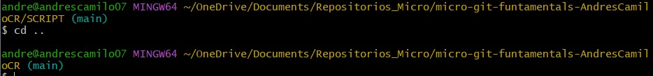
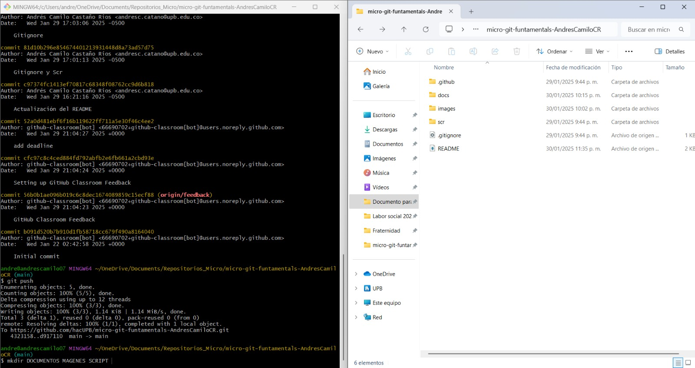
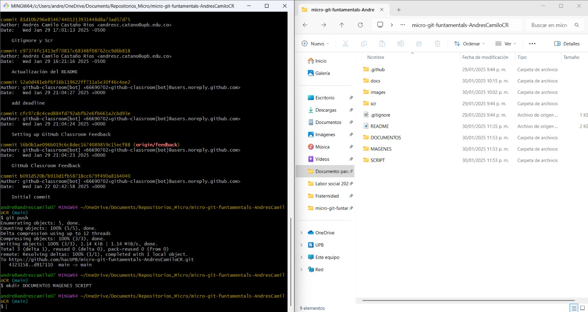

# CONSOLA PARA NAVEGAR EN EL SISTEMA DE ARCHIVOS
## Comandos básicos
`pwd `→ Muestra la ubicación actual.  
`cd` → Sale de todos los directorios. 
`cd` <nombre_directorio> → Entra en un directorio específico.  
`ls` → Lista los archivos y directorios en el directorio actual.  
`ls -al` → Lista todos los archivos, incluyendo los ocultos.  
`cd ..` → Regresa al directorio anterior.  

 
#### Creación y manipulación de archivos
`mkdir <nombre_directorio>` → Crea un nuevo directorio.  

Comando para crear documentos

`touch <archivo.txt>` → Crea un archivo de texto.  
`vim <archivo.txt>` → Abre un archivo de texto en Vim para editarlo.  
`cat <archivo.txt>` → Muestra el contenido de un archivo de texto.  
#### Comandos de Git
Inicialización y configuración 
`git init` → Inicia un repositorio local.  
`git clone` <URL> → Clona un repositorio remoto.  
##### Gestión de cambios
`git add` <archivo> → Añade un archivo al "stage" antes de guardarlo.  
`git commit -m "mensaje" `→ Guarda los cambios con un mensaje descriptivo.  
`git status` → Muestra el estado de los archivos en el repositorio.  
`git log` → Muestra el historial de commits.  

###### Sincronización con repositorio remoto  
`git pull` → Descarga la última versión del repositorio remoto.  
`git push` → Sube los cambios locales al repositorio remoto.  
###### Gestión de ramas
`git branch` → Lista todas las ramas.  
`git branch `<nombre_rama> → Crea una nueva rama.  
`git merge` <nombre_rama> → Fusiona una rama con la actual.  
###### Otros comandos útiles
`mv <directorio_origen> <directorio_destino>` → Mueve o renombra un directorio.  
`find . -name <nombre_directorio>` → Busca un directorio específico.  
`rm <archivo>` → Borra un archivo.  
`git code `→ Abre Visual Studio Code para iniciar la programación.

